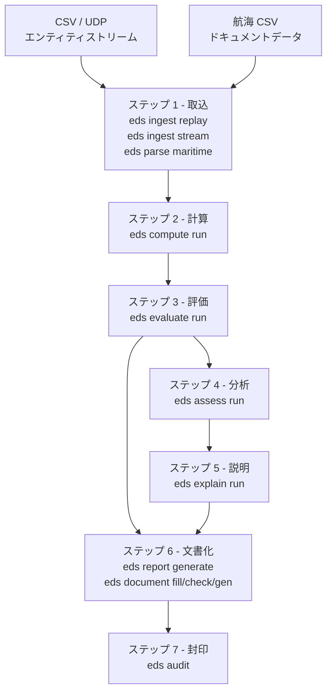

# アーキテクチャ

## パイプラインフロー



## ステージ出力

各ステージはヘッダ付き JSONL ファイルを書き出し、次のステージが読み込みます。

| ステージ出力 | スキーマ名 | 読み込み先 |
|---|---|---|
| `eds ingest replay / stream` | `eds.entity-frame` | `eds compute`、`eds evaluate` |
| `eds parse maritime` | `eds.document-entity` | `eds document fill` |
| `eds compute run` | `eds.measurement` | （参照用。evaluate は entity-frame を直接読み込む） |
| `eds evaluate run` | `eds.risk-event` | `eds assess`、`eds report generate` |
| `eds assess run` | `eds.assessment` | `eds report generate` |
| `eds explain run` | `eds.explanation` | `eds report generate` |
| `eds document fill` | `eds.filled-document` | `eds document check`、`eds document gen` |
| `eds document check` | `eds.compliance-alert` | オペレーターによる確認 |
| `eds report generate` | Markdown ファイル | 人によるレビュー、PDF 変換 |
| `eds document gen` | HTML ファイル | ブラウザ / PDF 印刷 |

## クレートマップ

```
edgesentry-ingest      CSV リプレイ、UDP ストリーム、JsonlReader/JsonlWriter
edgesentry-parse       航海 CSV → DocumentEntity
edgesentry-compute     euclidean_distance、relative_velocity、time_to_collision、
                       braking_distance、zone_membership
edgesentry-evaluate    ルール DSL（distance/ttc/zone_member）、RiskEvent
edgesentry-profile     rules.json ローダーとバリデーター
edgesentry-store       EventStore トレイト + InMemoryStore（assess が内部使用）
edgesentry-assess      トレンド検出、ルール頻度、エンティティ相関
edgesentry-explain     LlmClient（OpenAI 互換）、KnowledgeBase、Explainer
edgesentry-report      Markdown レポートジェネレーター
edgesentry-document    FilledDocument、ComplianceAlert、HTML テンプレートレンダラー
edgesentry-audit       BLAKE3 ハッシュチェーン + Ed25519 署名
edgesentry-bridge      edgesentry-audit の C/C++ FFI ブリッジ
```

## ドメイン別の適用例

7 つのステップはドメインを問わず共通です。データとプロファイルのみが異なります。

| ステップ | 安全監視 | ドキュメントコンプライアンス |
|---|---|---|
| ステップ 1 - 取込 | `eds ingest replay` -- フォークリフト/歩行者の位置 | `eds parse maritime` -- 航海 CSV |
| ステップ 2 - 計算 | 距離、TTC、制動距離 | （対象外 -- ドキュメントフィールド、物理演算なし） |
| ステップ 3 - 評価 | 安全ルール: PROXIMITY_ALERT、TTC_ALERT、EXCLUSION_ZONE_BREACH | コンプライアンスルール: BWM_D2_EXPIRED、DG_RESTRICTION |
| ステップ 4 - 分析 | アラート頻度の上昇、エンティティ相関 | （未実装） |
| ステップ 5 - 説明 | 規制引用付き LLM 説明 | （未実装） |
| ステップ 6 - 文書化 | `eds report generate` -- Markdown 安全レポート | `eds document gen` -- FAL Form 1 HTML |
| ステップ 7 - 封印 | `eds audit demo-lift-inspection` | （将来: `eds audit sign-document`） |
