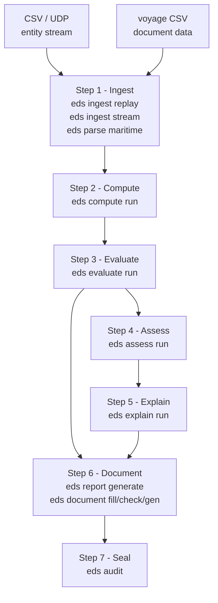

# Architecture

## Pipeline flow



## Stage outputs

Each stage writes a headed JSONL file consumed by the next:

| Stage output | Schema name | Consumed by |
|---|---|---|
| `eds ingest replay / stream` | `eds.entity-frame` | `eds compute`, `eds evaluate` |
| `eds parse maritime` | `eds.document-entity` | `eds document fill` |
| `eds compute run` | `eds.measurement` | (reference; evaluate reads entity-frame directly) |
| `eds evaluate run` | `eds.risk-event` | `eds assess`, `eds report generate` |
| `eds assess run` | `eds.assessment` | `eds report generate` |
| `eds explain run` | `eds.explanation` | `eds report generate` |
| `eds document fill` | `eds.filled-document` | `eds document check`, `eds document gen` |
| `eds document check` | `eds.compliance-alert` | reviewed by operator |
| `eds report generate` | Markdown file | human review, PDF conversion |
| `eds document gen` | HTML file | browser / PDF print |

## Crate map

```
edgesentry-ingest      CSV replay, UDP stream, JsonlReader/JsonlWriter
edgesentry-parse       Maritime CSV → DocumentEntity
edgesentry-compute     euclidean_distance, relative_velocity, time_to_collision,
                       braking_distance, zone_membership
edgesentry-evaluate    Rule DSL (distance/ttc/zone_member), RiskEvent
edgesentry-profile     rules.json loader and validator
edgesentry-store       EventStore trait + InMemoryStore (used internally by assess)
edgesentry-assess      Trend detection, rule frequency, entity correlation
edgesentry-explain     LlmClient (OpenAI-compat), KnowledgeBase, Explainer
edgesentry-report      Markdown report generator
edgesentry-document    FilledDocument, ComplianceAlert, HTML template renderer
edgesentry-audit       BLAKE3 hash chain + Ed25519 signatures
edgesentry-bridge      C/C++ FFI bridge for edgesentry-audit
```

## Domain examples

The same seven steps apply across domains — only the data and profiles differ:

| Step | Safety Monitoring | Document Compliance |
|---|---|---|
| Step 1 - Ingest | `eds ingest replay` -- forklift/pedestrian positions | `eds parse maritime` -- voyage CSV |
| Step 2 - Compute | Distance, TTC, braking distance | (not applicable -- document fields, not physics) |
| Step 3 - Evaluate | Safety rules: PROXIMITY_ALERT, TTC_ALERT, EXCLUSION_ZONE_BREACH | Compliance rules: BWM_D2_EXPIRED, DG_RESTRICTION |
| Step 4 - Assess | Rising alert frequency, entity correlation | (not yet implemented) |
| Step 5 - Explain | LLM explanation with regulation citation | (not yet implemented) |
| Step 6 - Document | `eds report generate` -- Markdown safety report | `eds document gen` -- FAL Form 1 HTML |
| Step 7 - Seal | `eds audit demo-lift-inspection` | (future: `eds audit sign-document`) |
